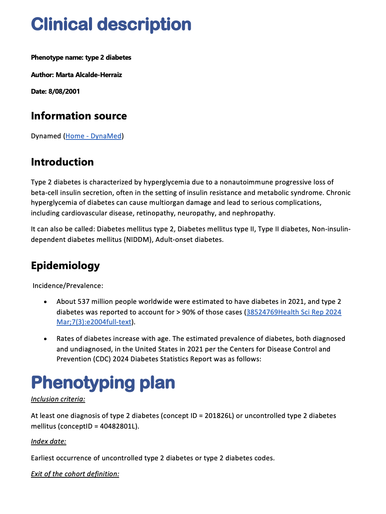

## Introduction

-   PhenotypeR package can help us to assess the research-readiness of a set of cohorts we have defined.

::: {style="margin-bottom: 10px;"}
:::

-   The code is publicly available in OHDSI's GitHub repository [PhenoypeR](https://github.com/OHDSI/PhenotypeR).

::: {style="margin-bottom: 10px;"}
:::

-   PhenotypeR 0.4 is available in [CRAN](https://cran.r-project.org/web/packages/PhenotypeR/index.html){.link}.

::: {style="margin-bottom: 10px;"}
:::

-   Vignettes with further information can be found in the package [website](https://ohdsi.github.io/PhenotypeR/){.link}.


## Set of Functions: Individual Diagnostics Assessment

::: {style="margin-bottom: 10px;"}
:::

::::::: columns
:::: {.column width="45%"}
-   **Database diagnostics**

    -   `databaseDiagnostics()`

::: {style="margin-bottom: 10px;"}
:::

-   **Codelist diagnostics**

    -   `codelistDiagnostics()`
::::

:::: {.column width="55%"}
-   **Cohort diagnostics**

    -   `cohortDiagnostics()`

::: {style="margin-bottom: 10px;"}
:::

-   **Population diagnostics**

    -   `populationDiagnostics()`
::::
:::::::


## Set of Functions: Phenotype Diagnostics

-   Comprises all the diagnostics that are being offered in this package.

. . .

```{r, eval = FALSE}
result <- phenotypeDiagnostics(
  cohort,
  databaseDiagnostics = list(),
  codelistDiagnostics = list(),
  cohortDiagnostics = list(),
  populationDiagnostics = list()
)
```

-   Run only some of the diagnostics:

. . .

```{r, eval = FALSE}
result <- phenotypeDiagnostics(
  cohort,
  databaseDiagnostics = NULL,
  codelistDiagnostics = list(),
  cohortDiagnostics = NULL,
  populationDiagnostics = list()
)
```


## Create a shiny app to visualise all the results!

-   Create a shiny app to visualize all the results

. . .

```{r, eval = FALSE}
shinyDiagnostics(result = result, 
                 directory = here(), 
                 minCellCount = 5, 
                 removeEmptyTabs = FALSE)
```

See an example in [here](https://dpa-pde-oxford.shinyapps.io/PhenotypeRShiny_OHDSIEuropeWorkshop/)

## Database Diagnostics

-   Summarise the database metadata including:
    1.  **Snapshot**
    2.  Summary of the **person table**
    3.  Summary of the **observation period**
    4.  Summary of the **clinical tables** (i.e., *condition_occurrence*) where the concepts of the codelist defining your cohort are found.

## Database Diagnostics

```{r, eval = FALSE}
db_diagnostics <- databaseDiagnostics(
  cohort,
  cohortId = NULL,
  snapshot = TRUE,
  personTableSummary = TRUE,
  observationPeriodsSummary = TRUE,
  clinicalRecordsSummary = TRUE
)

# Modify databaseDiagnostics in phenotypeDiagnostics:
result <- phenotypeDiagnostics(
  cohort,
  databaseDiagnostics = list(
    "cohortId" = c(1,2),
    "snapshot" = FALSE
  )
)
```

## Codelist Diagnostics

-   Summarise the codelist associated with your cohort including:
    1.  **Achilles codes use** (only if ACHILLES tables are present)
    2.  **Orphan codes use** (only if ACHILLES tables are present)
    3.  **Cohort code use**
    4.  **Measurement code use** (only if measurement concepts are present in your codelist)
    5.  **Drug diagnostics** (only if drug concepts are present in your codelist)

## Codelist Diagnostics

```{r, eval = FALSE}
cl_diagnostics <- codelistDiagnostics(
  cohort,
  cohortId = NULL,
  achillesCodeUse = TRUE,
  orphanCodeUse = TRUE,
  cohortCodeUse = TRUE,
  drugDiagnostics = TRUE,
  measurementDiagnostics = TRUE,
  measurementDiagnosticsSample = 20000,
  drugDiagnosticsSample = 20000
)

# Modify codelistDiagnostics in phenotypeDiagnostics:
result <- phenotypeDiagnostics(
  cohort,
  codelistDiagnostics = list(
    "cohortId" = c(1,2),
    "achillesCodeUse" = FALSE
  )
)
```


## Cohort Diagnostics

-   Summarise your cohort characteristics:
    1.  **Cohort count & attrition**
    2.  **Cohort characteristics**: Baseline characteristics of your cohort
    3.  **Large scale characteristics**: Summary of the records from clinical tables within a time window
    4.  **Compare cohorts**: Overlap and timing between cohorts (only if more than one cohort are present)
    5.  **Cohort survival**: Survival until the event of death (if death table is present)

## Cohort Diagnostics

```{r, eval = FALSE}
c_diagnostics <- cohortDiagnostics(
  cohort,
  cohortId = NULL,
  cohortCount = TRUE,
  cohortCharacteristics = TRUE,
  largeScaleCharacteristics = TRUE,
  compareCohorts = TRUE,
  cohortSurvival = FALSE, # Notice that by default, cohortSurvival it's not run!!
  cohortSample = 20000,
  matchedSample = 1000
)

# Modify cohortDiagnostics in phenotypeDiagnostics:
result <- phenotypeDiagnostics(
  cohort,
  cohortDiagnostics = list(
    "cohortSample" = 1000
  )
)
```

## Population Diagnostics

-   Contextualises the frequency of your study cohorts in the database calculating:
    1.  **Incidence**
    2.  **Period Prevalence**

## Population Diagnostics

```{r, eval = FALSE}
c_diagnostics <- populationDiagnostics(
  cohort,
  cohortId = NULL,
  incidence = TRUE,
  periodPrevalence = TRUE,
  populationSample = 1e+05,
  populationDateRange = as.Date(c(NA, NA))
)

# Modify populationDiagnostics in phenotypeDiagnostics:
result <- phenotypeDiagnostics(
  cohort,
  populationDiagnostics = list(
    "populationSample" = 10000
  )
)
```

## Summary:


::: {style="margin-bottom: 10px;"}
:::

::::::: columns
:::: {.column width="45%"}
-   **Database diagnostics**

    -   `databaseDiagnostics()`

::: {style="margin-bottom: 10px;"}
:::

-   **Codelist diagnostics**

    -   `codelistDiagnostics()`
::::

:::: {.column width="55%"}
-   **Cohort diagnostics**

    -   `cohortDiagnostics()`

::: {style="margin-bottom: 10px;"}
:::

-   **Population diagnostics**

    -   `populationDiagnostics()`
::::
:::::::

. . .

-   Run all the diagnostics together:

. . .

```{r, eval = FALSE}
result <- phenotypeDiagnostics(
  cohort,
  databaseDiagnostics = list(), 
  codelistDiagnostics = list(), 
  cohortDiagnostics = list(), 
  populationDiagnostics = list(), 
  stagingDirectory = NULL
)

shinyDiagnostics(result = result, 
                 directory = here(), 
                 minCellCount = 5, 
                 removeEmptyTabs = FALSE)
```

## Extra: Create a database description manually!

```{r, eval = FALSE}
downloadDatabaseDescriptionTemplate(
  directory = here(),
  name = "GiBleed") # Name of your database!!!!
```


## Extra: Create a clinical description manually!

```{r, eval = FALSE}
downloadClinicalDescriptionTemplate(
  directory = here(),
  name = "type_2_diabetes") # Name of your cohort!!!!
```



## Import your descriptions in the shiny app:

```{r, eval = FALSE}
shinyDiagnostics(result = result, 
                 directory = here(), 
                 minCellCount = 5,
                 clinicalDescriptionsDir = NULL,
                 databaseDescriptionsDir = NULL,
                 removeEmptyTabs = FALSE)
```

## PhenotypeR

::::: {style="display: flex; align-items: center; justify-content: space-between;"}
::: {style="flex: 1;"}
👉 [**Package website**](https://ohdsi.github.io/PhenotypeR/)\
👉 [**CRAN link**](https://cran.r-project.org/package=PhenotypeR)\
👉 [**GitHub link**](https://github.com/OHDSI/PhenotypeR)\
👉 [**Manual**](https://cran.r-project.org/web/packages/PhenotypeR/PhenotypeR.pdf) 📧
:::

::: {style="flex: 1; text-align: center;"}

:::
:::::
